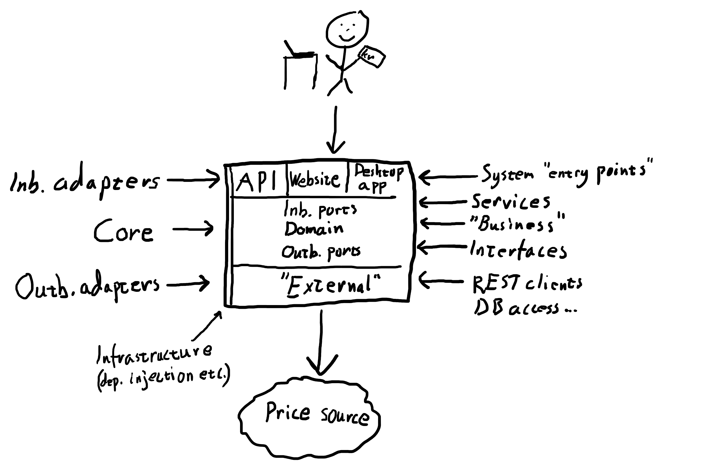

# HexagonalKata

This kata is about understanding the concepts around:

* [Hexagonal Architecture](https://blog.octo.com/en/hexagonal-architecture-three-principles-and-an-implementation-example/)
* [Test Driven Development (TDD)](https://en.wikipedia.org/wiki/Test-driven_development)
* [Dependency Injection (DI)](https://docs.microsoft.com/en-us/aspnet/core/fundamentals/dependency-injection)
* Api contract tests using [Approval Tests](https://github.com/approvals/ApprovalTests.Net)
* Some introduction to [avoiding primitive obsession using domain primitives](https://enterprisecraftsmanship.com/posts/functional-c-primitive-obsession/)

The conceptual parts of the Hexagonal Architecture are described in this incredibly pretty image (digital drawing boards are hard when not used to them!):



## Instructions
Open the solution in the `master` branch. The other branches are usable to look at one solution if you get stuck at some step, or if you want to start at a specific step.

All steps should be done using [test driven development (TDD)](https://en.wikipedia.org/wiki/Test-driven_development). That is, write the test first, and make the implementation do the expected things. Tests should start "red" (failing) when written, getting to "green" (passing) by implementing the functionality. When changing/refacting the implementation, tests might start to fail. You then need to make the tests pass again.

## Step 1

Create a `PurchaseService` as a inbound port to the Core. This service should have a `Purchase(int quantity)` method.

In this scenario we pretend that the actual price of the product is located in another system, so the Core needs to create an outbound port (interface) for accessing it. This dependency should be injected into the `PurchaseService` constructor.

## Step 2

Implement the outbound port interface used by `PurchaseService` created in step 1 as a class in the `External` project. This class can return a fixed value for simplicity.

## Step 3

Add a suitable endpoint to the Api that are used to make a purchase, using the `PurchaseService` in the Core. Remember to add the required dependencies to the `Startup` class, like:

```csharp
public void ConfigureServices(IServiceCollection services)
{
    ...

    // Dependency injection registrations
    services.AddScoped<PurchaseService>();
    services.AddScoped<IPricingClient, PricingClient>();

    ...
}
```

## Step 4

Add a test for the Api endpoint by calling the endpoint (use the `_client` field in the example unit test to do a call to an in-memory instance of the Api).

Assert that the json looks as expected by using [Approval Tests](https://github.com/approvals/ApprovalTests.Net), doing `ApprovalTests.Approvals.VerifyJson(content)` with the response content.

When running the test, a diff editor of some kind (depends on IDE used) will then appear. If the response looks correct, copy it to the empty side of the diff tool and save. This will now be the "approved" data that the `VerifyJson` call will compare to going forward. This will be saved as a file with the same name as the test and can be seen in the solution explorer.

The diff editor will show up whenever the actual data differs from the approved data when executing the test. If so, it's up to you to determine if the new data is correct or not. If a property has been renamed or deleted, it's probably a breaking change to the API, and probably should not be approved but rather versioned as a new endpoint.

If the response only differs by property values, you should probably add or adjust mocks of the outbound adapters in your tests, to avoid being dependent on external systems or other data that changes over time.

ApprovalTests also needs some initialization code, and this can be put at the top of the test file for this case:

```csharp
using ApprovalTests.Reporters;
[assembly: UseReporter(typeof(DiffReporter))]
```

## Step 5

The quantity parameter in the `PurchaseService.Purchase(int quantity)` method are an example of primitive obsession. Even though a quantity can be represented as an `int` in this case, the quantity have specific requirements in the domain

Create a separate `OrderQuantity` type in Core, that does some validation of your choise in the constructor. That is, doing `new OrderQuantity(-1)` should fail, if negative quantities are not allowed. The underlying `int` value could be accessed by a get-only property.

If you're feeling fancy you can also add implicit or explicit operators to `OrderQuantity` using [user-defined conversion operators](https://docs.microsoft.com/en-us/dotnet/csharp/language-reference/operators/user-defined-conversion-operators), to easier convert from or to `int`s. This will make the usage of the type more smooth by avoiding a lot of `new OrderQuantity`, but at the same time it might reduce the explicitness of the code, especially when using implicit operators.